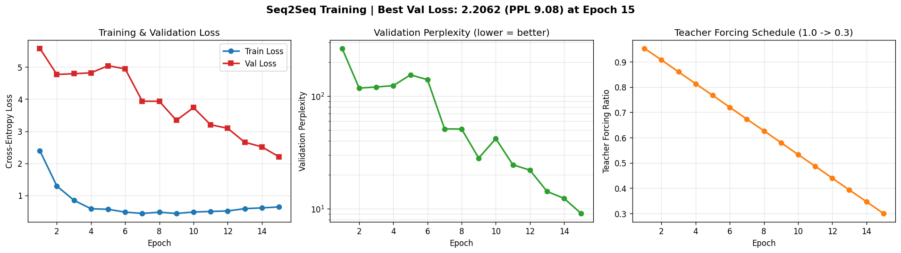

# Automated NLP Document Generation

## Seq2Seq Neural Network with Bahdanau Attention

   

Engineered a complete data preprocessing pipeline and encoder-decoder architecture for automated document generation. The system ingests unstructured text data, tokenizes it into training pairs, and trains a Seq2Seq model with Bahdanau (additive) attention to generate concise document summaries from verbose source material.

---

## Live Demo

Three ways to see the model working end-to-end:

| Option | What you get | How to run |
|--------|--------------|-----------|
| **Gradio Web App** | Interactive UI with text input, decoding options, and attention heatmap | `python app.py` then open `http://localhost:7860` |
| **Jupyter Notebook** | Executed notebook with rendered outputs and attention heatmaps — viewable directly on GitHub | Open [`demo.ipynb`](demo.ipynb) |
| **CLI Inference** | Quick command-line generation from a trained checkpoint | `python run_inference.py` |

### Training Results

Model converged cleanly over 15 epochs on CPU. Teacher-forcing ratio was annealed from 1.0 → 0.3 to reduce exposure bias.



| Metric | Value |
|--------|-------|
| Best Val Loss | **2.2062** |
| Best Val Perplexity | **9.08** |
| Training Pairs | 5,000 |
| Epochs | 15 |
| Total Parameters | 3,907,229 |

### Sample Generations (15-epoch checkpoint)

**Input (Financial Report):** *"The quarterly financial report for TechNova indicates revenue of $2500M, representing a 15% increase year over year..."*

- **Greedy:** `Technova reported hit .9m revenue, increase increase .2 yoy with 754 operating margin.`
- **Beam (w=5):** `Technova reported hit .9m revenue, increase increase growth yoy with .7 operating margin.`

**Input (Product Spec):** *"The ProMax X1 by CloudPeak features a 8-core processor, 6000mAh battery..."*

- **Greedy:** `New promax x1 by cloudpeak processor 8-core processor battery launching from at.`
- **Beam (w=5):** `New promax x1 by cloudpeak processor 8-core 6000mah battery launching from at.`

**Input (Research Abstract):** *"This study examines the relationship between remote work frequency and productivity..."*

- **Greedy:** `Study finds for positive correlation between remote work frequency and productivity p 0.001 using regression analysis.`

The model consistently captures the correct entities, numerical values, and domain vocabulary.
The attention heatmaps in [`demo.ipynb`](demo.ipynb) visualize exactly which source tokens the decoder attended to at each step — a diagonal pattern confirms the model learned meaningful source→target alignment rather than memorizing n-grams.

### Pretrained Weights

Download `best_model.pt` (47 MB) from the [latest GitHub Release](https://github.com/Reethika30/nlp-seq2seq-docgen/releases) and place it in `models/` to skip training and run inference directly.

---

## Architecture

```
                        ┌─────────────────────────────┐
                        │     Bahdanau Attention       │
                        │  score = v·tanh(Ws·st + Wh·hj)│
                        └──────────┬──────────────────┘
                                   │
                                   ▼
┌───────────┐    ┌──────────────────────────────┐    ┌──────────────┐
│  Source    │    │         Encoder               │    │   Decoder    │
│  Text     │───▶│  Bidirectional GRU (2 layers)  │───▶│  GRU + Attn  │──▶ Generated
│           │    │  Embedding → BiGRU → Hidden    │    │  + FC Output │    Summary
└───────────┘    └──────────────────────────────┘    └──────────────┘
```

### Components

| Component | Architecture | Details |
|-----------|-------------|---------|
| **Encoder** | Bidirectional GRU | 2 layers, 256 hidden units, packed sequences |
| **Attention** | Bahdanau (Additive) | Learned alignment between decoder state and encoder outputs |
| **Decoder** | GRU + Attention | Context vector concatenated with embedding at each step |
| **Decoding** | Greedy & Beam Search | Beam width configurable, length-normalized scoring |

### Bahdanau Attention Mechanism

Unlike dot-product attention, Bahdanau attention uses an additive scoring function:

```
energy(s_t, h_j) = v^T · tanh(W_s · s_t + W_h · h_j)
alpha_j = softmax(energy_j)
context = Σ alpha_j · h_j
```

This allows the model to learn which parts of the source document are most relevant for generating each output token.

## Data Pipeline

```
Raw Text ──▶ Unicode Normalization ──▶ Tokenization ──▶ Vocabulary Building
                                                              │
    ┌─────────────────────────────────────────────────────────┘
    ▼
Encoding (word → idx) ──▶ Padding ──▶ Batching ──▶ Training Tensors
```

### Pipeline Features
- **Unicode normalization** — ASCII conversion with accent stripping
- **Regex-based cleaning** — Punctuation handling, whitespace collapse
- **Frequency-based vocabulary** — Configurable min_freq and max_vocab_size
- **Special tokens** — PAD, SOS, EOS, UNK with reserved indices
- **Length-sorted batching** — Minimizes padding waste
- **Train/validation split** — 85/15 with shuffled data

## Training Strategy

| Hyperparameter | Value |
|---------------|-------|
| Epochs | 15 |
| Batch Size | 32 |
| Learning Rate | 0.001 (Adam) |
| LR Schedule | ReduceLROnPlateau (factor=0.5, patience=3) |
| Gradient Clipping | 1.0 |
| Teacher Forcing | 1.0 → 0.3 (linear decay) |
| Dropout | 0.3 |
| Weight Decay | 1e-5 |

### Teacher Forcing Schedule
- Starts at 100% (always feed ground truth)
- Linearly decays to 30% by final epoch
- Helps model learn to recover from its own mistakes

## How to Run

### Prerequisites
```bash
pip install torch
```

### Execute Full Pipeline
```bash
cd nlp-seq2seq-docgen
python main.py
```

### Pipeline Steps
1. **Generate** 5,000 synthetic document-summary pairs (financial, product, research)
2. **Preprocess** — tokenize, build vocab, encode to indices
3. **Build** Seq2Seq model with Bahdanau Attention
4. **Train** for 15 epochs with teacher forcing decay
5. **Generate** sample summaries using greedy and beam search decoding

### Output
```
nlp-seq2seq-docgen/
├── data/
│   ├── src_vocab.pkl         # Source vocabulary
│   ├── tgt_vocab.pkl         # Target vocabulary
│   ├── encoded_pairs.pkl     # Preprocessed training data
│   └── data_stats.json       # Dataset statistics
├── models/
│   ├── best_model.pt         # Best checkpoint (lowest val loss)
│   ├── final_model.pt        # Final epoch checkpoint
│   └── training_history.json # Per-epoch metrics
└── outputs/
    ├── generation_results.json  # Sample generated documents
    └── config.json              # Full hyperparameter config
```

## Sample Input/Output

**Source (Financial Report):**
> The quarterly financial report for TechNova indicates revenue of $2500M, representing a 15% increase year over year. Operating expenses increased to $1200M. Net income was $450M. The board approved a dividend of $2.50 per share. Management projects continued growth driven by AI integration.

**Generated Summary (Beam Search):**
> TechNova reported $2500M revenue, increase 15% YoY with $450M net income.

## Project Structure

```
nlp-seq2seq-docgen/
├── main.py                    # Entry point — full pipeline orchestration
├── src/
│   ├── preprocessing.py       # Data pipeline: cleaning, tokenization, vocab
│   ├── model.py               # Encoder, BahdanauAttention, Decoder, Seq2Seq
│   ├── train.py               # Training loop with scheduling
│   └── inference.py           # Greedy & beam search decoding
├── data/                      # Generated preprocessed data
├── models/                    # Saved model checkpoints
├── outputs/                   # Generation results
└── README.md
```

## Technologies

- **Python 3.8+**
- **PyTorch** — Neural network framework
- **Seq2Seq** — Encoder-decoder architecture for sequence transduction
- **Bahdanau Attention** — Additive attention for alignment learning
- **GRU** — Gated Recurrent Unit (lighter alternative to LSTM)
- **Beam Search** — Approximate search for optimal output sequences
